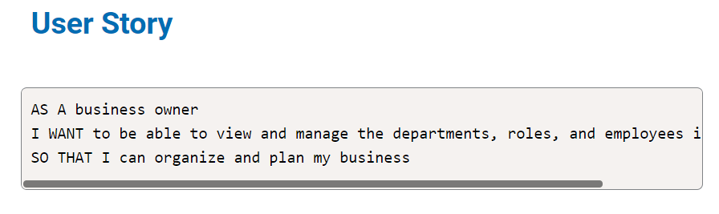
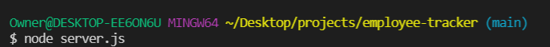
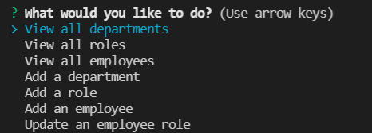
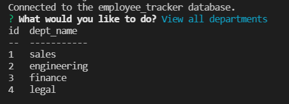
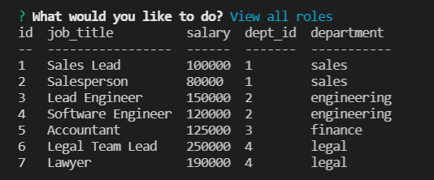
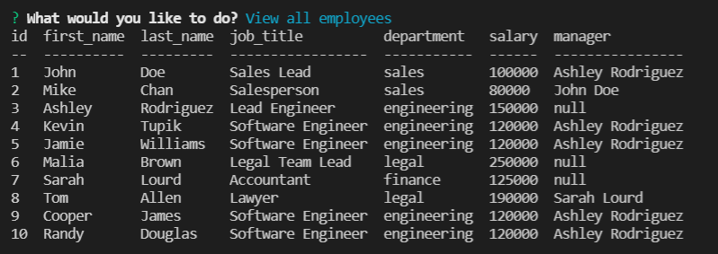
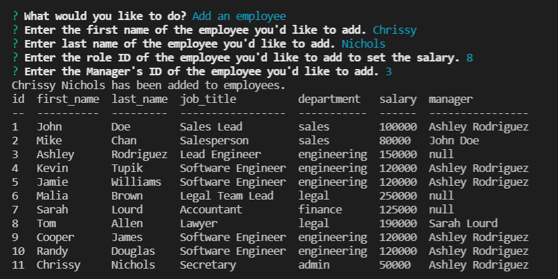
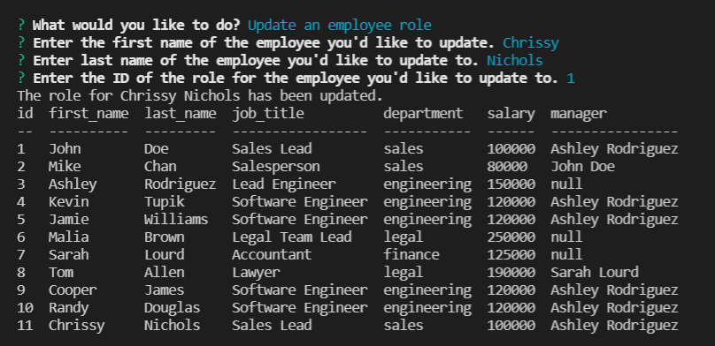

# Welcome to my EMPLOYEE TRACKER!

## Description

#### This EMPLOYEE TRACKER allows a business owner to view and manage the departments, roles, and employees in the company so they can plan and organize accordingly. 

## Table of Contents
* [Installation](#installation)
* [Usage](#usage)
* [License](#license)
* [Contributor](#contributor)
* [Demo](#demo)

## Installation
In order to run this Employee Tracker, you will need to install node.js.

## Usage
To use this app, clone this repository and run server.js on the command-line to start.

You will then be asked what you would like to do with a list that you can click on.

When you click on "View all departments" you will be given a table containing all the departments with their ID. 

When you click on "View all roles" you will be given a table containing all the roles including the ID, job title, salary, dept ID, and department.

When you click on "View all employees" you will be given a table containing all the employees including the ID, first name, last name, job title, department, salary, and manager.

When you click on "Add an employee" you will be asked to enter the employees first name, last name, role ID of the employee to set the salary, and the manager ID of the employee. When finished entering the information, you will receive a confirmation that the employee has been added and an updated employee list.

When you click on "Update an employee role" you will be asked to enter the employees first name, last name, and the ID of the role for the employee that you'd like to update to. When finished entering the information, you will receive a confirmation that the role of the employee has been updated and an updated employee list.

## License
The license for this project is the MIT.

Copyright © 2021

## Contributor
Jamie Williams

GitHub: [@jamwil1226](https://github.com/jamwil1226/)

## Addtional Contributors
Additional Contributors welcome! Reach out to me if you are interested!

## Demo
Watch this demo to see the Employee Tracker in action!
https://www.loom.com/share/3744a2ec2a364777aa86e5ab4655663a

## Questions
*If you have any questions, please reach out to me at* 

GitHub: [@jamwil1226](https://github.com/jamwil1226/)

Email: [jamwil1226@yahoo.com](mailto:jamwil1226@yahoo.com)

### I hope you enjoy using this Employee Tracker! I welcome all contributions and feedback!

### I look forward to hearing from you!

### _Jamie Williams_ 

